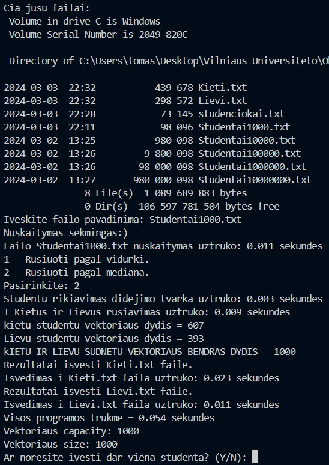

# Objektinis-Programavimas
Objektinis Programavimas

## V0.2 tyrimų rezultatai iš 5 testų:
`studentai10000.txt failo skaitymas = 0.0926 sekundės`
`studentai100000.txt failo skaitymas = 0.9226 sekundės`
`studentai1000000.txt failo skaitymas = 4.479 sekundės`

## V0.3 
● Programą turi tris failus, funkcijos.cpp, funkcijos.h ir Vector_V0_3.cpp.
● Yra pridėti try catch blokai.
● Vartotojas gali pasirinkti failų skaitymą iš savo turimų failų.

## V0.4  
Failų kūrimas  
1000.txt =  
10000.txt =   
100000.txt =   
1000000.txt =   
10000000.txt =   

Failų nuskaitymas ir išvedimas į kietus, lievus, bei visus  
1000.txt =     
10000.txt =     
100000.txt =     
1000000.txt =     
10000000.txt =     

